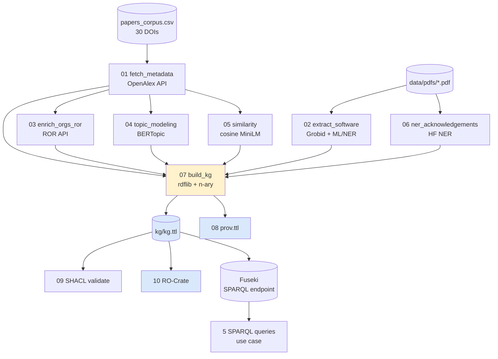

# Workflow sketch

## Vista general

## Detalle de cada paso

### 01 — `fetch_metadata.py`
- **Input**: DOI por fila en `data/papers_corpus.csv`.
- **Acción**: `GET https://api.openalex.org/works/<doi>` (parámetro `mailto` para *polite pool*).
- **Output**: `data/metadata/openalex.json` (lista de objetos Work).

### 02 — `extract_software.py`
- **Input**: PDFs en `data/pdfs/`.
- **Acción**: para cada PDF (a) Grobid → TEI XML, (b) párrafos del body → modelo NER de software (`oeg/SoMeSci-software-mentions`), (c) regex de GitHub/Zenodo URLs como aumentación.
- **Output**: `data/raw/software_mentions.json`.
- **Atributo clave en el KG**: `iaos:extractionMethod = "Grobid + ML/NER (SoMeSci) + URL heuristics"`.

### 03 — `enrich_orgs_ror.py`
- **Input**: instituciones y funders de `openalex.json`.
- **Acción**: si OpenAlex trae `ror`, se usa directo; si no, búsqueda por nombre contra ROR.
- **Output**: `data/raw/ror.json`.

### 04 — `topic_modeling.py`
- **Input**: abstracts reconstruidos desde OpenAlex (inverted index).
- **Acción**: embeddings con MiniLM + BERTopic (`min_topic_size=2`, `calculate_probabilities=True`).
- **Output**: `data/raw/topics.json` con catálogo de topics + asignaciones por encima del threshold.

### 05 — `similarity.py`
- **Input**: mismos abstracts.
- **Acción**: cosine similarity sobre embeddings normalizados, descarte por threshold.
- **Output**: `data/raw/similarity.json` (solo pares ≥ 0.70).

### 06 — `ner_acknowledgements.py`
- **Input**: PDFs (acknowledgements via Grobid).
- **Acción**: NER → PER/ORG; regex para grant IDs.
- **Output**: `data/raw/ner.json`.

### 07 — `build_kg.py` ★
- **Input**: todos los JSON anteriores.
- **Acción**: construir el grafo RDF con `rdflib`, usando los patrones n-arios del diagrama:
    - `Person --hasAffiliation--> Affiliation --atOrganization--> Organization`
    - `Paper --hasTopicAssignment--> TopicAssignment --aboutTopic--> Topic`
    - `SimilarityRelation paper1 ?p1; paper2 ?p2; score; threshold; method`
- **Output**: `kg/kg.ttl` y `kg/kg.nq`.

### 08 — `prov.py`
- Emite `kg/prov.ttl` con `prov:Activity`/`prov:Entity`/`prov:wasGeneratedBy` por paso, hashes SHA-1 y los thresholds usados.

### 09 — `validate_shacl.py`
- Valida `kg/kg.ttl` contra `ontology/shapes.shacl.ttl`. Falla la build si hay violaciones.

### 10 — `make_ro_crate.py`
- Empaqueta todo el experimento como RO-Crate en `ro-crate/`.

## Decisiones de diseño en el workflow

- **Idempotencia**: cualquier paso se puede re-ejecutar sin romper los siguientes (siempre que los JSON de entrada estén disponibles).
- **Caché de APIs**: `openalex.json` y `ror.json` se guardan en disco; las APIs no se re-llaman a no ser que se borren.
- **Determinismo parcial**: BERTopic no es 100 % determinista entre versiones de UMAP. Para reproducibilidad estricta documentamos el SHA del lockfile y el commit en PROV.
- **Modularidad**: cada paso es un script independiente con `if __name__ == "__main__"`. Esto facilita correrlos uno a uno desde la línea de comandos, lo que también permite escalar (por ejemplo, paralelizar Grobid sobre los 30 PDFs).
